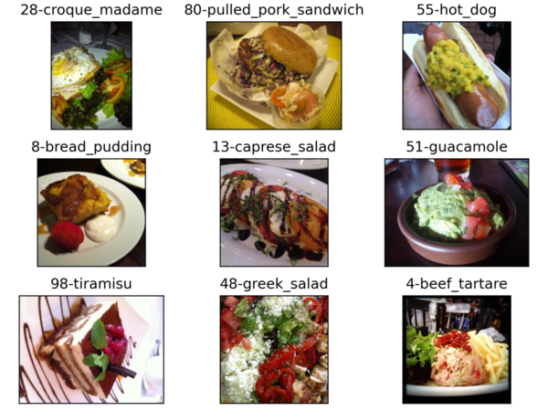

# Food101-ViT-Pytorch

##  Samples of [Food101- Dataset](https://data.vision.ee.ethz.ch/cvl/datasets_extra/food-101)

## Model Framework
- The Classification Framework is implemented by Vision Transformer (Vit_b_16): [An Image is Worth 16x16 Words: Transformers for Image Recognition at Scale](https://arxiv.org/abs/2010.11929)
- The Model is pretrained with [SWAG trunk weights](https://arxiv.org/abs/2201.08371), SWAG stands for Supervised Weakly through hashtAGs and enables weak supervision by utilizing the textual information provided through hashtags as an additional source of knowledge. By utilizing this weak supervision technique, we can effectively leverage large-scale unlabeled datasets and enhance the performance of our models.
- These weights are composed of the original frozen SWAG trunk weights and a linear classifier learnt on top of them trained on ImageNet-1K data.
The model and pretrained weights can be found through [TorchVision](https://pytorch.org/vision/main/models/generated/torchvision.models.vit_b_16.html#torchvision.models.ViT_B_16_Weights)

### Repo Files:
[Dataset_food.py](Dataset_food.py): load dataset with their splits and transformations. 
[TransferModel.py](TransferModel.py): contains the `Model` class for Visual models (CNNs and ViT) and their finetuning for this dataset. 
[Main.py](Main.py): contains the functions for training and testing Models. 
[Food101.ipynb](Food101.ipynb): the central script, which coordinates the various modules to achieve Food101 Classification task. 

## Accuracy Comparison for Vision Transformer with and without SWAG pre-trained weights

| Model         | Accuracy      |
| ------------- | ------------- |
| VIT_b16: ImageNet weights       | 68.9%         |
| VIT_b16: ImageNet_SWAG weights  | 83.6%         |
